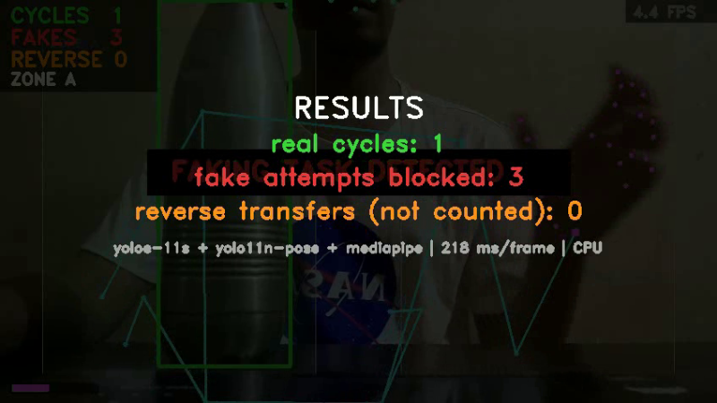
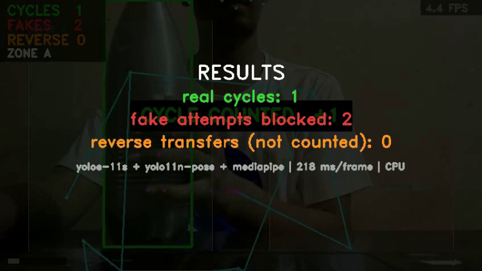
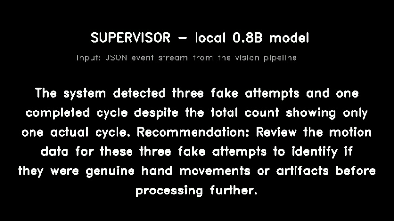
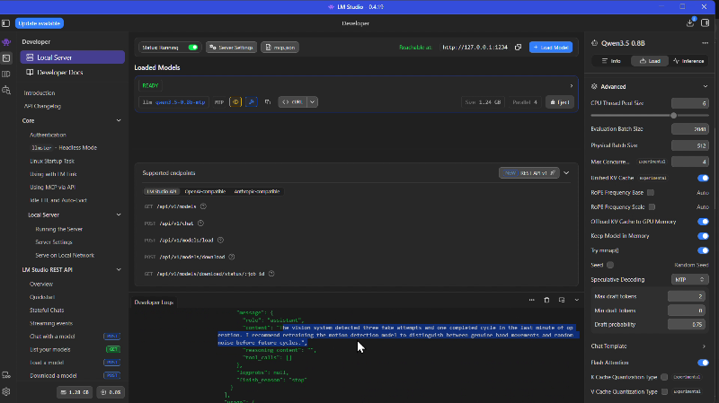

# cycle-verify

A camera feed tells you whether real work happened. This pipeline counts completed work cycles, flags fake work (hand motion with no part movement), and catches reverse transfers. No faces, no biometrics - identity is a track and a zone, not a person.

Built in a day, on a laptop, CPU only.


*Video: the pipeline running on a real clip, then the local LLM supervisor in LM Studio reading the event stream.*

## Proof of work (frames from the runs above)

| Fake work blocked | Real cycle counted |
|---|---|
|  |  |

| Local supervisor (0.8B) | LM Studio source |
|---|---|
|  |  |

## What happens in the demo

A person moves a bottle between two zones on a desk, and tries to game the system three times by moving only their hands.

| Event | System response |
|---|---|
| Bottle carried Zone A -> Zone B | CYCLE COUNTED (+1) |
| Bottle carried back B -> A | REVERSE TRANSFER - not counted |
| Hands moving, bottle stationary | FAKING TASK DETECTED - counter frozen |
| End of clip | Local LLM (0.8B, LM Studio) reads the JSON event stream and gives the shift summary |

In this run: 1 real cycle, 3 fake attempts blocked, 0 counted reverses. The work direction (which way is "forward") is not configured - the state machine learns it from the first deliberate carry.

## Why the anti-gaming part matters

Hand-motion alone proves nothing - anyone can wave. A cycle only counts when the tracked object physically progresses between zones. That makes the counter hard to game with motion alone, and it makes every count auditable: the event log says exactly when and why. The LLM never does the counting. Numbers come from a deterministic state machine; the model only narrates.

## This repo: the demo path vs the production path

Two different things live here, on purpose:

**The demo path (what `pipeline.py` runs today):** three off-the-shelf models called per frame, a zone state machine, OpenCV rendering, an optional local LLM. Unoptimized by design - it exists to prove the logic, not the throughput.

```
video -> YOLOE (text-prompted) -----> bottle/flask/can boxes + confidence
      -> yolo11n-pose ---------------> body skeleton, wrist keypoints
      -> MediaPipe Hands ------------> finger keypoints
      -> zone state machine ---------> cycle / reverse events (hysteresis + EMA smoothing)
      -> hand-motion vs part-speed --> fake-work detection
      -> JSON events -> local LLM ---> shift summary
```

**The production path (design notes, not code here):** how this scales to factories x cameras x 24/7 - see the last section.

The object detector is text-prompted on purpose. In this clip the object is a steel flask - a class standard COCO detectors never found (0 detections at any confidence). One text prompt ("bottle, flask, can, cup, thermos") and it tracks at 0.87 confidence. That is the onboarding story: point at a new object type in words, no retraining.

## Reproduce it (exact steps)

Machine with Python 3.11-3.12. Nothing else assumed.

```
# 1. environment
uv venv .venv
uv pip install --python .venv/Scripts/python.exe -r requirements.txt
# (on Linux/macOS the interpreter path is .venv/bin/python)

# 2. run the pipeline on any clip with an object and a person
.venv/Scripts/python.exe pipeline.py --input your_clip.mp4 --output out.mp4

# 3. optional: LLM supervisor segment
#    start LM Studio, load any small instruct model, enable the local server (default http://127.0.0.1:1234)
#    rerun the same command - if the server answers, a summary segment is appended; if not, it is skipped
```

Expected console output on success:

```
[done] N frames -> out.mp4 (X MB)
[stats] cycles=.. fakes=.. reverses=.. | ~2XX ms/frame | events: [(t, 'CYCLE'), ...]
[llm] <model's two-sentence summary>
[llm] supervisor segment appended
```

First run downloads model weights automatically (yoloe-11s-seg, yolo11n-pose - about 50 MB total; MediaPipe bundles its own). Every tunable is a constant at the top of `pipeline.py`: zone ranges, hysteresis frames, motion thresholds, fake-attempt cooldown.

## Benchmarks (laptop CPU, no GPU)

| Metric | Value |
|---|---|
| Total pipeline latency | ~220-340 ms/frame (3 models, serial, CPU) |
| Object detector | yoloe-11s, 640px |
| Pose | yolo11n-pose, 320px |
| Fingers | MediaPipe Hands |
| Weights on disk | ~50 MB total |

For reference, a single-model YOLO11n at 320px runs at ~55 ms/frame on the same CPU. The three-model stack is deliberately unoptimized - that headroom is the point.

## What production looks like

The real system differs from this repo in degree, not kind:

- **Pipeline**: Savant (Python over DeepStream) instead of per-frame script calls - zero-copy NVMM buffers, NVDEC hardware decode, multi-stream batching on one GPU.
- **Detection**: YOLO26-class detector, TensorRT INT8 with quantization-aware training in the nightly retrain loop (raw PTQ loses small parts under shifting factory light). Open-vocab models stay in the onboarding/data engine, not steady-state serving.
- **Tracking**: Deep OC-SORT - factory cameras are static, so camera-motion compensation is wasted compute, and identical uniforms make appearance re-ID useless. Zone-anchored stitching handles occlusion breaks.
- **Work measurement**: temporal action segmentation (MS-TCN++ class) over backbone features instead of hand-coded states, so new factory layouts need labeled examples, not new code.
- **Frames**: ~5 FPS baseline with tracker propagation, bursting to 15 FPS on motion energy - you analyze events, not every frame.
- **Edge**: Jetson Orin per factory (or Hailo for <5W sites), Redis ring buffer for the retention window, only JSON events leave the plant. No raw video, no faces, nothing biometric.
- **Cloud**: MQTT/IoT Core fleet management, auto-queued low-confidence clips into the labeling flywheel, canary model rollouts, vLLM-served supervisor over event streams.
- **Roofline logic throughout**: decode is memory-bound, so every optimization is "move fewer bytes" - INT8, zero-copy, keyframes, batching.

## Files

- `pipeline.py` - everything: perception, state machine, rendering, LLM hook
- `demo_full.mp4` - pipeline output + the LM Studio supervisor, back to back
- `shot_*.png` - frames used above
- `requirements.txt`
